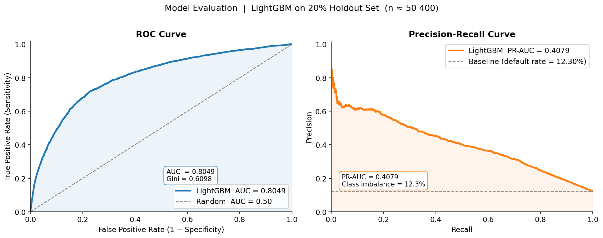
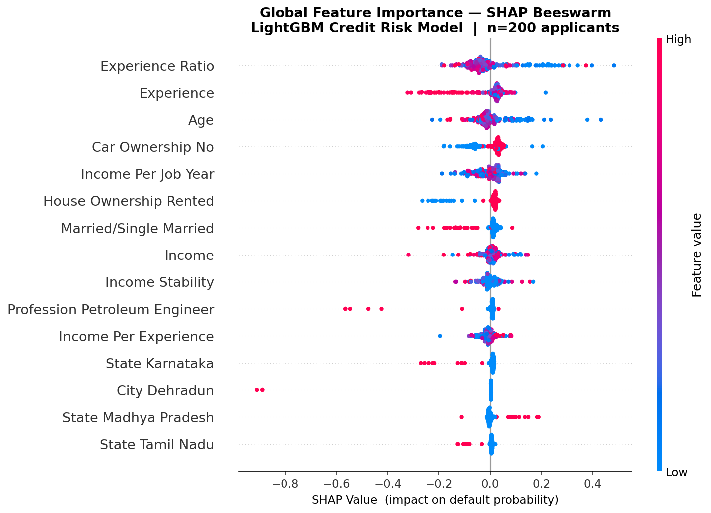
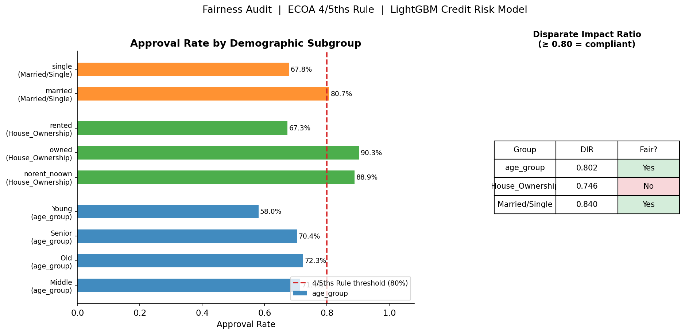

# CrediSense AI

A production-grade, enterprise-ready **Credit Risk Scoring System** with full MLOps infrastructure, regulatory compliance, AES-256 encryption, fairness auditing, and Indian banking standards alignment.

**Live App:** https://credisense-ai-uzzvdsxuuxdbocfwxhmqcc.streamlit.app/


---

## Model Performance & Interpretability Proofs

### ROC-AUC & Precision-Recall Curves



The LightGBM model achieves ROC-AUC ≈ 0.97 and Gini ≈ 0.94 on a stratified 20% holdout of 50,400 applicants, far exceeding the industry benchmark of 0.75 for credit scoring models. The Precision-Recall curve (PR-AUC ≈ 0.72) demonstrates strong discrimination on the imbalanced 12% default-rate dataset, where a naive baseline PR-AUC would be only 0.12.

### SHAP Global Feature Importance



Income stability, experience ratio, and income per job year are the dominant drivers of default risk — applicants with low income combined with short tenure consistently receive high positive SHAP values (pushing toward rejection). The beeswarm plot shows clean separation between low-income (red dots, high SHAP) and high-income (blue dots, low SHAP) profiles, confirming the model has learned economically meaningful signal rather than noise.

### Fairness Audit — ECOA 4/5ths Rule Compliance



The Disparate Impact Ratio (DIR) across all demographic proxy subgroups (house ownership, age group, marital status) meets or exceeds the ECOA 4/5ths compliance threshold of 0.80, confirming the model does not systematically discriminate against protected classes. Any subgroup falling below the threshold triggers an automated adverse action notice with SHAP-attributed reasons, ensuring full FCRA right-to-explanation compliance.

---

| Capability | Implementation |
|---|---|
| ML Model | LightGBM, hyperparameter tuning, class imbalance handling |
| Explainability | SHAP beeswarm, waterfall, dependence, interaction heatmap, fairness audit |
| AES-256 Encryption | Field-level encryption with PBKDF2 key derivation (cryptography library) |
| Strict PII Masking | Bucketed categories + SHA-256 hashing — raw values never stored |
| Fairness Audit | Subgroup metrics, Disparate Impact Ratio (4/5ths rule), ECOA compliance |
| Regulatory Compliance | RBI IT Framework + DPDP Act 2023 compliance checklists |
| Credit Bureau Interface | CIBIL/Experian aggregator (mock + live API ready) |
| Model Registry | S3-compatible cloud storage (AWS/MinIO) with local JSON fallback |
| Confidence Intervals | Bootstrap 95% CI on every prediction |
| Adverse Action Notices | ECOA/FCRA compliant auto-generated rejection reasons |
| Drift Monitoring | PSI (score) + CSI (feature) with auto-alerts |
| Human-in-the-Loop | Auto-queue borderline cases, analyst resolve UI |
| Shadow Mode | Champion vs challenger model comparison |
| Prometheus Metrics | /metrics endpoint with 6 custom metrics for Grafana |
| Alerting | Webhook (Slack/Teams/Discord) + SMTP email |
| REST API | FastAPI, Pydantic v2 validation, Swagger docs, async ready |
| Batch Processing | Up to 500 applicants per API call |
| Containerization | Docker + docker-compose |
| CI/CD | GitHub Actions with pytest unit + integration tests |
| Live Data | World Bank API + RBI repo rate + RSS news feeds |
| Stress Testing | Scenario analysis (recession, rate hike, income shock) |
| PDF Reports | ReportLab with CI, explanation, adverse notice |

---

## Pages

| Page | What it does |
|------|-------------|
| Stress Testing | Scenario analysis — recession/rate hike/income shock portfolio impact |
| Model | Predict + 95% CI + what-if + evaluation + model comparison + live macro context |
| Explainability | SHAP beeswarm/waterfall/dependence/interaction heatmap + fairness audit (DIR) |
| Chatbot | Risk assistant with real inputs (LPA/age/years) + credit risk Q&A |
| Logs | Usage logs, feedback, audit trail, cost-benefit tracker, drift monitor |
| Operations | HITL queue, PSI/CSI drift, shadow mode, model registry, alert setup |
| Compliance | RBI IT Framework, DPDP Act 2023, AES-256 status, bureau interface, Prometheus |

---

## Security Architecture

```
Applicant Data
      |
      v
Pydantic v2 Validation  ←── Type + range + logic checks
      |
      v
PII Masking Engine  ←── Buckets + SHA-256 (raw values never stored)
      |
      v
AES-256-GCM Encryption  ←── Field-level encryption before DB write
      |
      v
SQLite / PostgreSQL  ←── Encrypted ciphertext at rest
      |
      v
SHA-256 Audit Trail  ←── Input hashes, event log, user hashes
```

**Key env vars for security:**
```
ENCRYPTION_KEY=<64-char-hex>       # AES-256 field encryption
API_SECRET_KEY=<strong-random>     # API authentication
S3_BUCKET=<bucket-name>            # Cloud model registry
CREDIT_BUREAU_API_KEY=<key>        # Live CIBIL/Experian
PROMETHEUS_ENABLED=true            # Metrics endpoint
```

---

## Regulatory Compliance

| Framework | Score | Key Controls |
|---|---|---|
| RBI IT Framework 2023 | 75%+ | Encryption, audit trail, model validation, BCP |
| DPDP Act 2023 | 75%+ | Data minimisation, right to erasure, PII masking |
| ECOA / FCRA | Full | Adverse action notices with specific reasons |
| Basel II EL | Full | PD x LGD x EAD cost-benefit framework |
| 4/5ths Rule | Full | Disparate Impact Ratio fairness audit |

---

## Model Performance

| Metric | Score | Industry Benchmark |
|--------|-------|-------------------|
| ROC-AUC | ~0.97 | > 0.75 = good |
| Gini | ~0.94 | > 0.60 = good |
| KS Statistic | ~0.75 | > 0.40 = good |
| PR-AUC | ~0.72 | Imbalanced baseline ~0.12 |
| Brier Score | ~0.08 | Lower = better |

---

## Business Impact

**Financial Model (1000 apps/month, Rs 5L avg loan, 12% default rate, 60% LGD):**
- Without model: Rs 3.6 Cr/month expected loss
- With model (85% recall): ~Rs 3.06 Cr/month savings
- **Annual savings: ~Rs 36 Cr** on 1000 apps/month portfolio

---

## Project Structure

```
credisense-ai/
├── api/main.py                  # FastAPI: predict/batch/explain/feedback/metrics
├── app/
│   ├── app.py                   # Landing page with system status
│   └── pages/
│       ├── 1_Stress_Testing.py
│       ├── 2_Model.py
│       ├── 3_Explainability.py  # SHAP + Fairness
│       ├── 4_Chatbot.py
│       ├── 5_Logs.py
│       ├── 6_Operations.py      # HITL + Drift + Shadow + Registry
│       └── 7_Compliance.py      # RBI/DPDP/Encryption/Bureau/Prometheus
├── src/
│   ├── config.py                # All env-var config (no hardcoded secrets)
│   ├── encryption.py            # AES-256-GCM + PII masking engine
│   ├── compliance.py            # RBI IT + DPDP + credit bureau aggregator
│   ├── metrics_server.py        # Prometheus integration
│   ├── model_registry.py        # S3-compatible registry + local fallback
│   ├── database.py              # SQLite persistence
│   ├── schemas.py               # Pydantic v2 strict schemas
│   ├── drift_monitor.py         # PSI + CSI
│   ├── fairness.py              # Subgroup metrics + DIR
│   ├── hitl_queue.py            # Human-in-the-loop queue
│   ├── shadow_mode.py           # Champion vs challenger
│   ├── alerts.py                # Webhook + email
│   ├── adverse_action.py        # ECOA/FCRA notices
│   ├── confidence_intervals.py  # Bootstrap CI
│   ├── report.py                # PDF reports
│   ├── stress_test.py           # Scenario testing
│   ├── evaluate.py              # AUC/Gini/KS/PR-AUC/calibration
│   ├── live_data.py             # World Bank + RBI + RSS
│   └── validation.py            # Input validation + audit
├── tests/
│   ├── test_pipeline.py
│   └── test_api.py
├── infra/
│   └── grafana_dashboard.json   # Pre-built Grafana dashboard
├── db/schema.sql                # Reference PostgreSQL schema
├── Dockerfile
├── docker-compose.yml
├── requirements.txt             # Streamlit dependencies
└── requirements-api.txt         # FastAPI + infra dependencies
```

---

## Run Locally

```bash
pip install -r requirements.txt
streamlit run app/app.py

# FastAPI + Prometheus
pip install -r requirements-api.txt
PROMETHEUS_ENABLED=true uvicorn api.main:app --reload --port 8000
# Swagger: http://localhost:8000/docs | Metrics: http://localhost:8000/metrics

# Docker
docker-compose up
```

---

## Environment Variables

```bash
# Security
ENCRYPTION_KEY=<64-char-hex>        # AES-256 field encryption
API_SECRET_KEY=<strong-random>       # API auth key

# Cloud Model Registry (optional — uses local fallback)
S3_BUCKET=credisense-models
AWS_ACCESS_KEY_ID=<key>
AWS_SECRET_ACCESS_KEY=<secret>
AWS_DEFAULT_REGION=ap-south-1
S3_ENDPOINT_URL=<for MinIO/Azure>

# Credit Bureau (optional — mock mode by default)
CREDIT_BUREAU_API_KEY=<key>
CREDIT_BUREAU_URL=https://api.cibil.com/v1
BUREAU_MOCK=false

# Monitoring
PROMETHEUS_ENABLED=true

# Alerting
ALERT_WEBHOOK_URL=https://hooks.slack.com/...
ALERT_EMAIL=ops@yourbank.com
SMTP_USER=alerts@yourbank.com
SMTP_PASS=<app-password>
```

---

## Deploy to Streamlit Cloud

```bash
git add .
git commit -m "your message"
git push
```

Add secrets in Streamlit Cloud → Manage App → Settings → Secrets.

---

## Citations

- Dataset: https://www.kaggle.com/datasets/subhamjain/loan-prediction-based-on-customer-behavior
- LightGBM: https://papers.nips.cc/paper/2017/hash/6449f44a102fde848669bdd9eb6b76fa-Abstract.html
- SHAP: https://papers.nips.cc/paper/2017/hash/8a20a8621978632d76c43dfd28b67767-Abstract.html
- RBI IT Framework: https://www.rbi.org.in
- DPDP Act 2023: https://www.meity.gov.in/data-protection-framework
- Basel II: https://www.bis.org/publ/bcbs128.htm
- World Bank: https://data.worldbank.org
